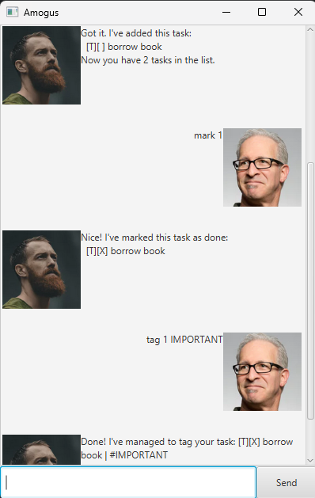

# Amogus User Guide

Amogus is a **ChatBot for managing different types of tasks, optimized for use mostly via Command Line Interface (CLI)**. Even after you turn off and back on the ChatBot, whatever tasks you saved previously will still be there!

- [Features](#features)
  - [Adding tasks](#adding-tasks)
  - [Listing tasks: `list`](#listing-tasks-list)
  - [Marking/Unmarking tasks: `mark`/`unmark`](#markingunmarking-tasks-markunmark)
  - [Tagging tasks: `tag`](#tagging-tasks-tag)
  - [Finding tasks: `find`](#finding-tasks-find)
  - [Deleting tasks: `delete`](#deleting-tasks-delete)
  - [Exiting ChatBot: `bye`](#exiting-chatbot-bye)
- [Command Summary](#command-summary)
  
## Features
### Adding tasks

Adds different types of tasks into the list of tasks.
- For a ToDo task, format: `todo {task}`
- For a Deadline task, format: `deadline {task} /by {date}`
- For an Event task, format: `event {task} /from {start} /to {end}`

### Listing tasks: `list`

Shows a list of all added tasks.\
Format: `list`

### Marking/Unmarking tasks: `mark`/`unmark`

Marks/Unmarks a task as complete/incomplete.\
- For marking a task, format: `mark {index of task in list}`
- For unmarking a task, format: `unmark {index of task in list}`

### Tagging tasks: `tag`

Tags a task with given tag.\
Format: `tag {index of task in list} {tag}`

### Finding tasks: `find`

Finds tasks in the list with the given keyword.\
Format: `find {keyword}`

### Deleting tasks: `delete`

Deletes task from the list.\
Format: `delete {index of task in list}`

### Exiting ChatBot: `bye`

Exits and closes ChatBot.\
Format: `bye`

### Command Summary

| Command | Format |
|---------|--------|
| Add | `todo {task}`, `deadline {task} /by {date}`, `event {task} /from {start} /to {end}`|
| List | `list` |
| Mark | `mark {index of task in list}` |
| Unmark | `unmark {index of task in list}` |
| Tag | `tag {index of task in list} {tag}` |
| Find | `find {keyword}` |
| Delete | `delete {index of task in list}` |
| Exit | `bye` |